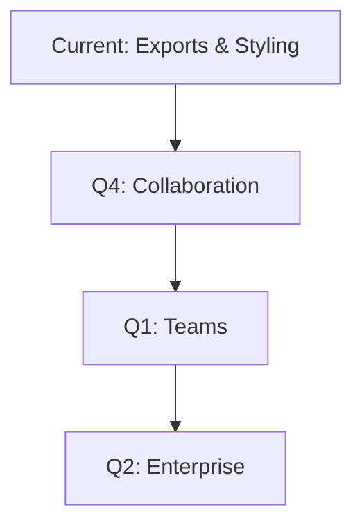

## Overview

FastMindMap evolves rapidly to help you organize ideas faster. Review recent releases below to see new features, bug fixes, and improvements. You stay productive with enhanced exports, better performance, and upcoming collaboration tools.

<Callout kind="info">
  Enable auto-updates in your settings to receive new versions instantly.
</Callout>

## Recent Releases

<Update label="2024-10-15" description="v1.1.0" tags={["feature", "improvement"]}>

## New Features

- Export maps to Word documents with styled nodes and metadata preserved
- PDF exports now support high-resolution images and custom layouts
- Added image export with transparency options for PNG files

## Improvements

- Node styling performance increased by 40% for large maps
- Metadata editor now includes searchable tags

## Bug Fixes

- Fixed crash when dragging nodes with embedded images
- Resolved export issues on macOS with special characters

</Update>

<Update label="2024-09-20" description="v1.0.1" tags={["bugfix"]}>

## Bug Fixes

- Corrected node connection rendering on zoom levels `>200%`
- Fixed undo/redo stack overflow in maps with `>100` nodes
- Improved keyboard navigation for screen readers

## Improvements

- Faster initial map loading by 25%

</Update>

<Update label="2024-08-10" description="v1.0.0" tags={["feature", "breaking"]}>

## New Features

- Core mind mapping with drag-and-drop nodes
- Rich styling: colors, shapes, icons for nodes
- Metadata support: notes, links, dates per node

## Breaking Changes

- Updated node format for better extensibility—import old maps via converter tool

</Update>

## Upcoming Roadmap

View planned features to plan your workflows.

<Columns cols={3}>
  <Card title="Q4 2024" icon="zap" href="#">
    Real-time collaboration and sharing links.
  </Card>
  <Card title="Q1 2025" icon="users" href="#">
    Team workspaces and version history.
  </Card>
  <Card title="Q2 2025" icon="shield" href="#">
    Advanced security and enterprise exports.
  </Card>
</Columns>



## Update FastMindMap

Follow these steps to get the latest version.

<Tabs>
  <Tab title="macOS" icon="apple">

<Steps>
  <Step title="Check for Updates" icon="refresh-cw">
    Open FastMindMap > Preferences > Updates.
  </Step>
  <Step title="Install" icon="download">
    Click Update Now and restart the app.
  </Step>
</Steps>

  </Tab>
  <Tab title="Windows" icon="monitor">

<Steps>
  <Step title="Run Updater" icon="settings">
    Right-click tray icon > Check for Updates.
  </Step>
  <Step title="Restart" icon="refresh-cw">
    Apply changes and relaunch.
  </Step>
</Steps>

  </Tab>
</Tabs>

## Integrate with Code

Embed maps programmatically.

<CodeGroup tabs="JavaScript,Python">
  ```javascript
  import { embedMap } from '@fastmindmap/embed';

  const mapId = 'your-map-id';
  embedMap(mapId, {
    container: '#map-viewer',
    theme: 'light'
  });
  ```
  ```python
  from fastmindmap import embed

  map_id = "your-map-id"
  embed.embed_map(
      map_id=map_id,
      container_id="#map-viewer",
      theme="light"
  )
  ```
</CodeGroup>

<Expandable title="Detailed Migration Guide" default-open="false">

For v1.0.0 users, run the built-in converter:

1. File > Import Legacy Map
2. Select your `.fmm` file
3. Review changes in preview

</Expandable>