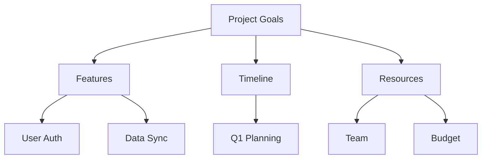

## Overview

FastMindMap lets you build dynamic mind maps with styled nodes, rich metadata, real-time collaboration, and flexible exports. Start by creating a central idea, then branch out with connections, customize appearances, and share your work. This guide walks you through key features to produce professional maps quickly.

<Columns cols={3}>
  <Card title="Style Nodes" icon="palette" href="#">
    Apply colors, shapes, and fonts to nodes.
  </Card>
  <Card title="Add Metadata" icon="tag" href="#">
    Attach notes, links, and data to elements.
  </Card>
  <Card title="Collaborate" icon="users" href="#">
    Invite team members for live editing.
  </Card>
</Columns>

## Create a Basic Mind Map

Follow these steps to build your first map.

<Steps>
  <Step title="Add Central Node" icon="target">
    Click the `+` button in the canvas center. Enter your main idea, such as `Project Goals`.
  </Step>
  <Step title="Branch Out" icon="git-branch">
    Hover over the node and drag to create child nodes. Add topics like `Features`, `Timeline`, and `Resources`.
  </Step>
  <Step title="Connect Freely" icon="link">
    Select nodes and draw curved or straight lines between them for custom relationships.
  </Step>
</Steps>



## Style Nodes and Connections

Customize visuals to make maps intuitive.

<Tabs>
  <Tab title="Nodes" icon="circle">
    Right-click a node to access the style panel.

    <CodeGroup tabs="JSON Config,CSS Classes">
      ```json
      {
        "color": "#f7c527",
        "shape": "ellipse",
        "fontSize": 16,
        "borderWidth": 2
      }
      ```
      ```css
      .node-primary {
        background-color: #f7c527;
        border-radius: 50%;
        font-weight: bold;
      }
      ```
    </CodeGroup>
  </Tab>
  <Tab title="Connections" icon="link">
    Select a line and choose line type, color, or arrowheads.

    <Callout kind="tip">
      Use dashed lines for tentative ideas and solid for confirmed ones.
    </Callout>
  </Tab>
</Tabs>

## Manage Metadata

Attach extra data without cluttering visuals.

<Expandable title="Advanced Metadata Options" default-open="false">
  Add properties like due dates, priorities, or URLs to any node.

  | Property | Type | Example |
  |----------|------|---------|
  | `dueDate` | Date | `2024-12-31` |
  | `priority` | Number | `1` (high) to `5` (low) |
  | `url` | String | `https://example.com/docs` |
  | `notes` | Text | Detailed description here |

  Edit via the sidebar inspector.
</Expandable>

## Collaborate in Real Time

Share maps with your team seamlessly.

<Steps>
  <Step title="Invite Users" icon="user-plus">
    Click `Share` in the top bar and enter emails.
  </Step>
  <Step title="Set Permissions" icon="shield">
    Choose viewer, editor, or admin roles.
  </Step>
  <Step title="Live Sync" icon="refresh-cw">
    Changes appear instantly for all participants.
  </Step>
</Steps>

<Callout kind="info">
  Collaboration requires a Pro plan. Free users get read-only shares.
</Callout>

## Export Your Maps

Output in multiple formats for reports or presentations.

<Tabs>
  <Tab title="PDF" icon="file-text">
    Select `Export > PDF`. Choose layout: radial or orthogonal.

    <Image
      src="https://example.com/pdf-export.png"
      alt="PDF export preview with styled mind map"
      width="600"
      height="400"
    />
  </Tab>
  <Tab title="Word" icon="file-word">
    Export as `.docx` with editable text layers.
  </Tab>
  <Tab title="Image" icon="image">
    Save as PNG or SVG at up to 4K resolution.
  </Tab>
</Tabs>

Master these tools to transform ideas into clear, shareable visuals with FastMindMap. Experiment with styles and metadata for unique maps tailored to your needs.