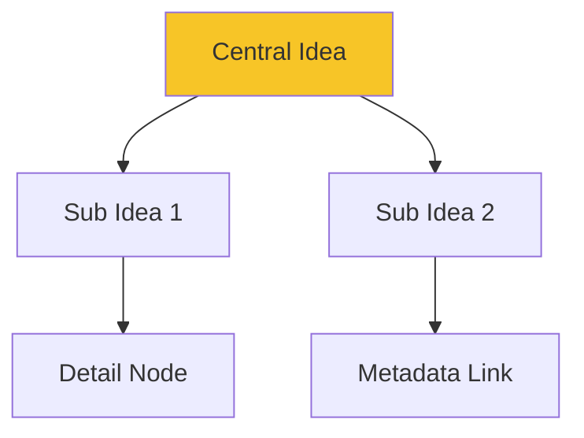

## Overview

FastMindMap, built by InnovationGear, empowers you to create dynamic mind maps and concept maps at the speed of thought. You visually organize ideas, connect concepts with styled nodes, and attach metadata like notes or links. Export your maps to Word, PDF, or images for seamless sharing.

This tool transforms brainstorming sessions into structured visuals, helping you capture and refine thoughts quickly.

## Key Benefits and Use Cases

FastMindMap accelerates your workflow across scenarios.

<Tabs>
  <Tab title="Brainstorming" icon="zap">
    Generate ideas rapidly during meetings. Connect nodes with drag-and-drop for instant collaboration.
  </Tab>
  <Tab title="Project Planning" icon="calendar">
    Outline tasks, dependencies, and timelines. Add metadata for assignees and deadlines.
  </Tab>
  <Tab title="Note Taking" icon="book-open">
    Organize lecture notes or research into hierarchical maps. Export to PDF for reviews.
  </Tab>
</Tabs>

<Callout kind="tip">
  Start with a central node to anchor your ideas, then branch out for maximum clarity.
</Callout>

## Core Features

Explore the essential capabilities that make FastMindMap stand out.

<Columns cols={3}>
  <Card title="Styled Nodes" icon="palette" href="/docs/nodes">
    Customize colors, shapes, and fonts. Apply themes for consistent visuals.
  </Card>
  <Card title="Metadata" icon="tag" href="/docs/metadata">
    Attach notes, URLs, and files to nodes. Access rich details on hover.
  </Card>
  <Card title="Exports" icon="download" href="/docs/export">
    Generate Word docs, PDFs, or PNGs. Share polished outputs instantly.
  </Card>
</Columns>

## Get Started in Minutes

Follow these steps to create your first mind map.

<Steps>
  <Step title="Create New Map" icon="plus">
    Open FastMindMap and select `New Map`. Add a central node with your main idea.
  </Step>
  <Step title="Add Branches" icon="git-branch">
    Drag to connect child nodes. Double-click to edit text and style.
  </Step>
  <Step title="Enhance with Metadata" icon="info">
    Right-click a node and select `Add Metadata`. Include links or notes.
  </Step>
  <Step title="Export" icon="download">
    Choose `Export` from the menu. Select PDF for sharing.
  </Step>
</Steps>

## Node Structure Example

FastMindMap uses a simple JSON-like structure for nodes, enabling programmatic access.

<CodeGroup tabs="JSON,TypeScript">
```json
{
  "id": "root-1",
  "text": "Central Idea",
  "style": {
    "color": "#f7c527",
    "shape": "ellipse"
  },
  "metadata": {
    "notes": "Key project goal",
    "url": "https://example.com"
  },
  "children": [
    {
      "id": "child-1",
      "text": "Sub Idea 1"
    }
  ]
}
```
```typescript
interface Node {
  id: string;
  text: string;
  style?: {
    color: string;
    shape: string;
  };
  metadata?: {
    notes: string;
    url: string;
  };
  children: Node[];
}

const rootNode: Node = {
  id: "root-1",
  text: "Central Idea",
  style: { color: "#f7c527", shape: "ellipse" },
  metadata: { notes: "Key project goal", url: "https://example.com" },
  children: [{ id: "child-1", text: "Sub Idea 1" }]
};
```
</CodeGroup>

## Visual Idea Flow

See how FastMindMap structures thoughts:



<Expandable title="Advanced Export Options" default-open="false">
  Export configurations let you customize outputs:

  | Format | Use Case          | Settings                  |
  |--------|-------------------|---------------------------|
  | PDF    | Reports           | Page size, margins        |
  | Word   | Documents         | Headings, fonts           |
  | PNG    | Presentations     | Resolution, transparent   |

  Use `YOUR_API_KEY` for batch exports via the API.
</Expandable>