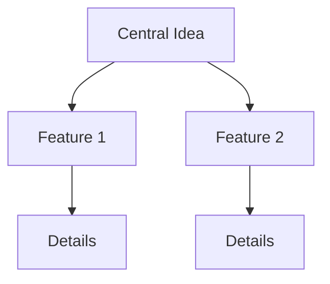

## Signing Up and Logging In

Start your FastMindMap journey by creating an account. Follow these steps to access the dashboard.

<Steps>
  <Step title="Visit the Site" icon="globe">
    Open your browser and navigate to `https://app.fastmindmap.com`.
  </Step>
  <Step title="Sign Up" icon="user-plus">
    Click the `Sign Up` button. Enter your email, create a strong password, and verify your account via email.
  </Step>
  <Step title="Log In" icon="log-in">
    Return to the login page, enter your credentials, and click `Log In`. You land on the dashboard.
  </Step>
</Steps>

<Callout kind="tip">
  Enable two-factor authentication in your account settings for added security.
</Callout>

## Navigating the Interface

FastMindMap features an intuitive interface. Use these key sections to manage your work efficiently.

<Columns cols={3}>
  <Card title="Dashboard" icon="layout-dashboard" href="/docs/dashboard">
    View recent maps, quick actions, and import options.
  </Card>
  <Card title="Editor" icon="edit-3" href="/docs/editor">
    Build and style your mind maps with drag-and-drop tools.
  </Card>
  <Card title="Library" icon="book-open" href="/docs/library">
    Organize, search, and share your saved maps.
  </Card>
</Columns>

## Creating a New Mind Map

Build your first map in seconds.

<Steps>
  <Step title="New Map" icon="plus">
    From the dashboard, click `New Mind Map`. Choose a blank template.
  </Step>
  <Step title="Name It" icon="tag">
    Enter a title like `Project Ideas` and select a color theme.
  </Step>
  <Step title="Start Editing" icon="edit">
    The canvas opens. Double-click the center node to edit text.
  </Step>
</Steps>

## Adding and Connecting Nodes

Expand your map by adding nodes and links.

<Tabs>
  <Tab title="Add Node" icon="plus-circle">
    Right-click a node and select `Add Child` or press `<kbd>Enter</kbd>`. Type your idea, like `Marketing Strategy`.
  </Tab>
  <Tab title="Connect Nodes" icon="link">
    Drag from one node to another to create a connection. Use `Ctrl+Drag` (`Cmd+Drag` on Mac) for curved links.
  </Tab>
  <Tab title="Style Node" icon="palette">
    Select a node, then use the sidebar to change color, shape, or add icons.
  </Tab>
</Tabs>

<Callout kind="success">
  Save automatically happens every 30 seconds. Export via `File > Export` to PDF or PNG.
</Callout>

## Sample Mind Map Flow

Visualize a basic structure:



## Next Steps

<Columns cols={2}>
  <Card title="Advanced Styling" icon="brush" href="/docs/styling">
    Customize nodes with metadata and themes.
  </Card>
  <Card title="Collaboration" icon="users" href="/docs/collaboration">
    Share maps and invite team members.
  </Card>
</Columns>

<Expandable title="Keyboard Shortcuts" default-open="false">
  - `<kbd>Tab</kbd>`: Add sibling node
  - `<kbd>Enter</kbd>`: Add child node
  - `<kbd>Delete</kbd>`: Remove selected node
  - `<kbd>Ctrl+S</kbd>`: Force save
</Expandable>

You now have a working mind map. Experiment with exports next.

<CodeGroup tabs="JavaScript,Python">
```javascript
// Embed map in your app
const embedMap = (mapId) => {
  const iframe = document.createElement('iframe');
  iframe.src = `https://app.fastmindmap.com/embed/${mapId}`;
  document.body.appendChild(iframe);
};
```
```python
# Export via API (requires YOUR_API_KEY)
import requests
response = requests.post(
  'https://api.fastmindmap.com/v1/export',
  json={'mapId': 'your-map-id', 'format': 'pdf'},
  headers={'Authorization': 'Bearer YOUR_API_KEY'}
)
```
</CodeGroup>